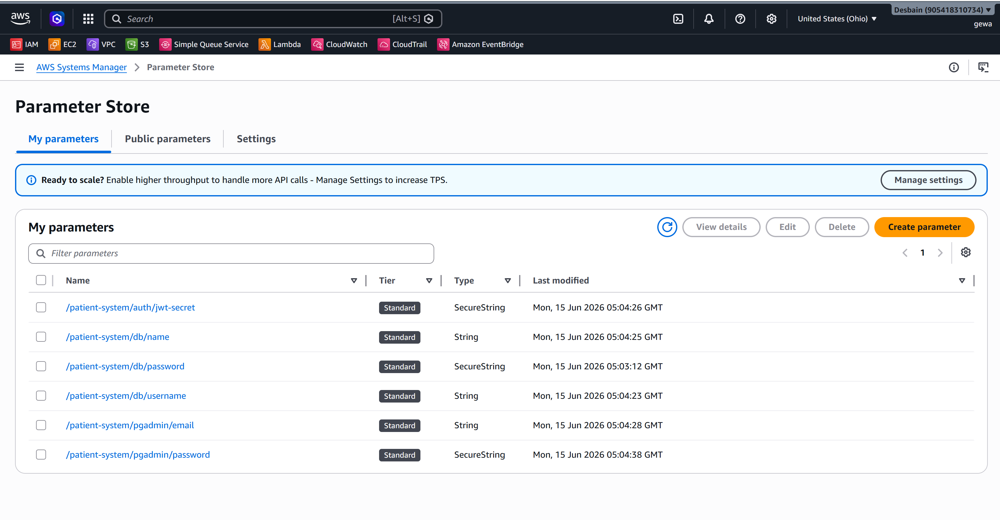
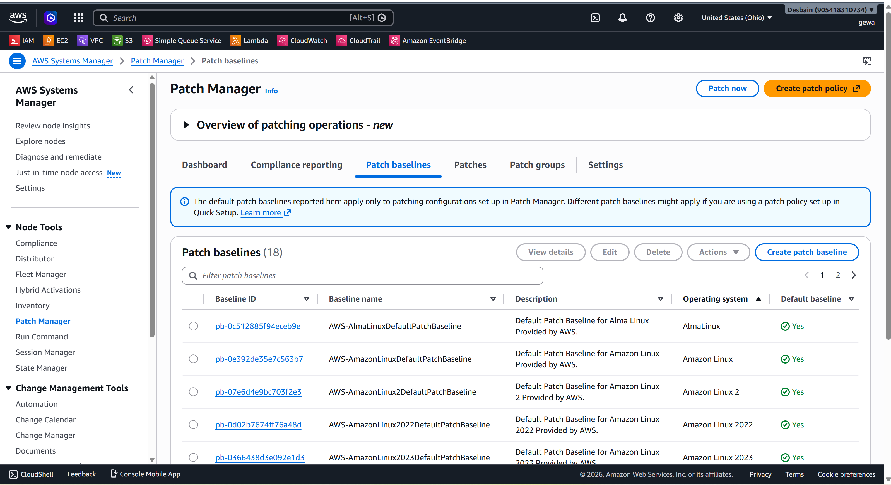
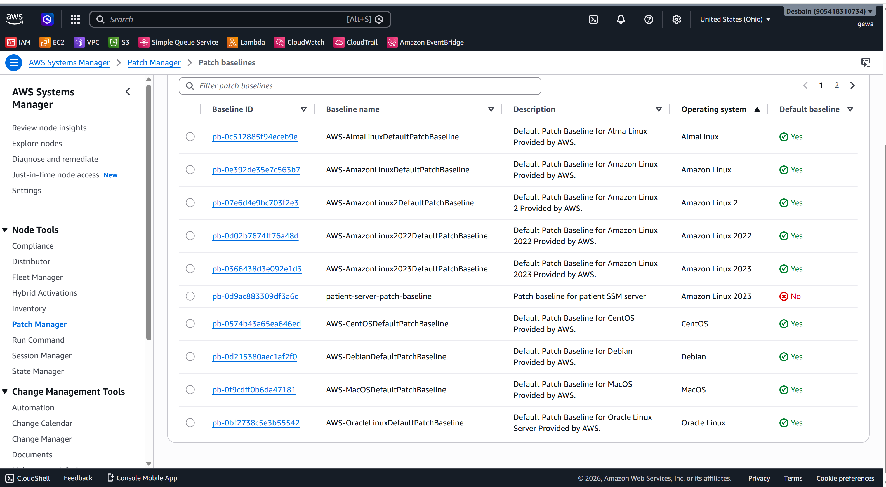
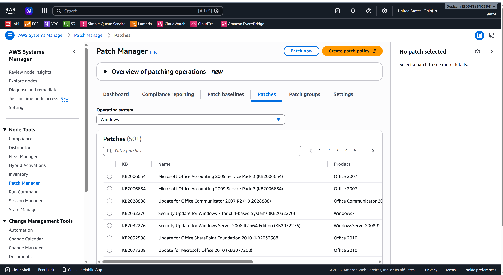
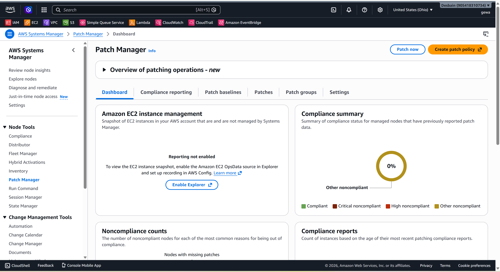
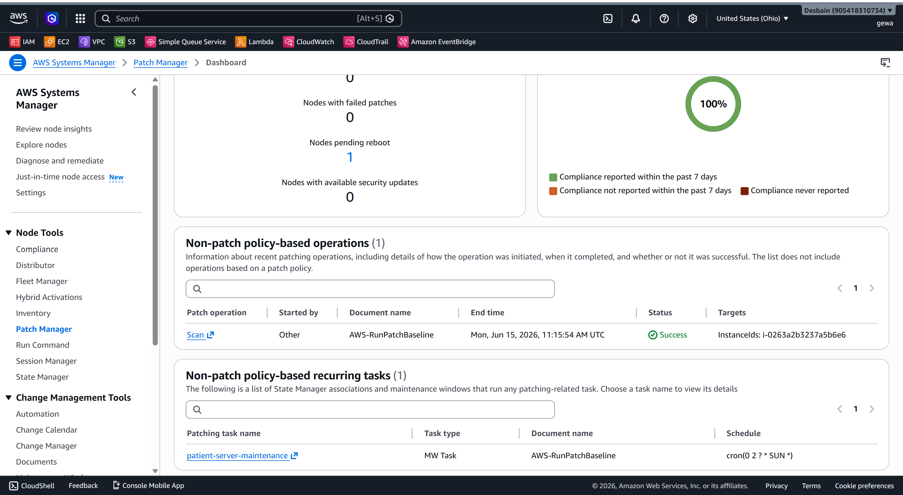
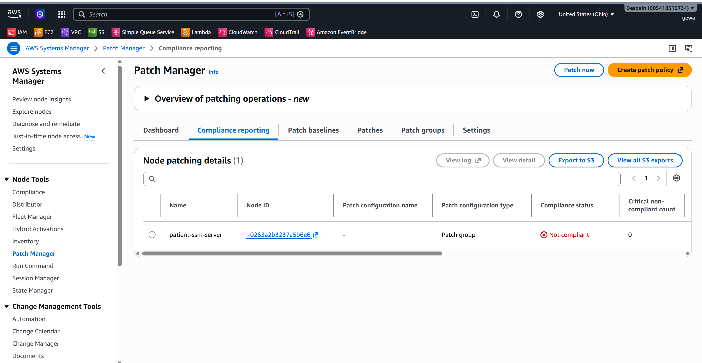
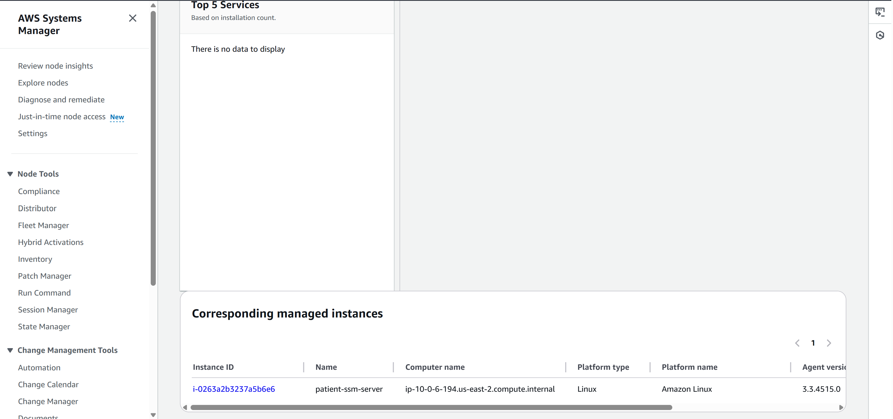
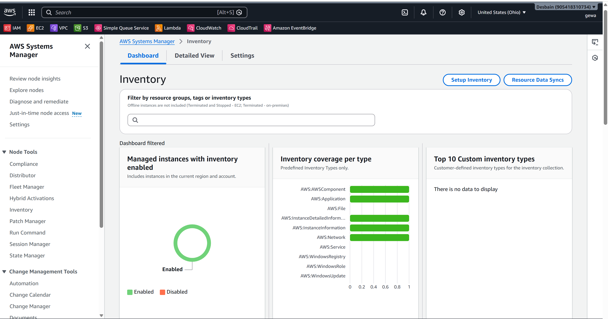
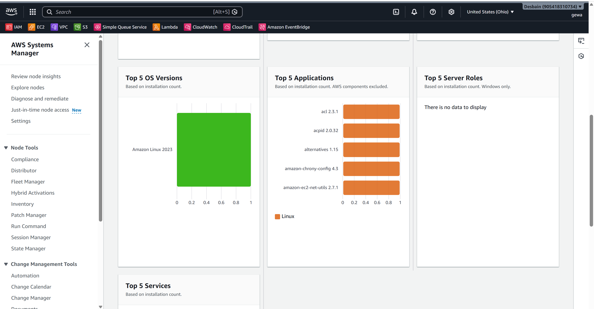

# 🖥️ AWS Systems Manager Automation Projects

A collection of AWS Systems Manager (SSM) automation projects
demonstrating DevSecOps practices for managing and automating
AWS infrastructure without SSH access.

## 🎯 Projects

| Project | Description | Status |
|---|---|---|
| Session Manager | SSH-free terminal access to EC2 | 🔨 In Progress |
| Run Command | Run scripts across multiple servers | ⬜ Planned |
| Parameter Store | Secure secrets management | ⬜ Planned |
| Patch Manager | Automated EC2 patching | ⬜ Planned |
| Automation Runbooks | Incident response automation | ⬜ Planned |
| State Manager | Configuration compliance | ⬜ Planned |
| Inventory | Software tracking across fleet | ⬜ Planned |

## 🏗️ Architecture

\`\`\`
┌─────────────────────────────────────────────────┐
│                  AWS Account                    │
│                                                 │
│  ┌─────────────┐      ┌─────────────────────┐  │
│  │    Your     │      │   Systems Manager   │  │
│  │   Browser   │─────▶│                     │  │
│  │  (Console)  │      │  - Session Manager  │  │
│  └─────────────┘      │  - Run Command      │  │
│                        │  - Parameter Store  │  │
│  ┌─────────────┐      │  - Patch Manager    │  │
│  │  VS Code    │      │  - Automation       │  │
│  │  Terminal   │─────▶│  - State Manager    │  │
│  │  (AWS CLI)  │      │  - Inventory        │  │
│  └─────────────┘      └──────────┬──────────┘  │
│                                   │              │
│                                   ▼              │
│                        ┌─────────────────────┐  │
│                        │      EC2 Fleet      │  │
│                        │                     │  │
│                        │  patient-ssm-server │  │
│                        │  (No SSH needed!)   │  │
│                        │  SSM Agent running  │  │
│                        └─────────────────────┘  │
└─────────────────────────────────────────────────┘
\`\`\`

## 🔐 Security Benefits

\`\`\`
TRADITIONAL SSH:                SSM:
────────────────────────────────────────────
Port 22 open            No ports needed
.pem keys to manage     IAM controls access
No audit trail          Full CloudTrail logs
Manual access           Automated access
Hard to scale           Scale to 1000s
Not DoD compliant       DoD/NIST compliant ✅
\`\`\`

## 📋 Prerequisites

- AWS Account with IAM user (gewa)
- AWS CLI configured
- EC2 instance with SSM Agent
- IAM role: AmazonSSMManagedInstanceCore

## 🚀 Quick Start

\`\`\`bash
# Connect to EC2 via Session Manager (no SSH!)
aws ssm start-session \
  --target INSTANCE_ID \
  --region us-east-2
\`\`\`

## 📁 Project Structure

\`\`\`
aws-ssm-automation/
├── session-manager/        ← SSH-free access
├── run-command/            ← Remote script execution
│   └── scripts/            ← Shell scripts to run
├── parameter-store/        ← Secrets management
├── patch-manager/          ← Auto patching
├── automation-runbooks/    ← Incident automation
├── state-manager/          ← Config compliance
├── inventory/              ← Software tracking
├── docs/                   ← Documentation
└── screenshots/            ← Project screenshots
\`\`\`

## 💼 Real World Use Cases

\`\`\`
Healthcare DevSecOps:
────────────────────────────────────────────
✅ HIPAA compliant access (no exposed ports)
✅ Full audit trail of all server access
✅ Automated patch compliance reporting
✅ Secrets management (DB passwords, API keys)
✅ Fleet-wide configuration management
✅ Automated incident response

DoD/Government:
────────────────────────────────────────────
✅ NIST 800-53 compliant
✅ Zero trust architecture
✅ No bastion hosts needed
✅ Centralized access control
✅ Complete audit logging
✅ STIG compliance automation
\`\`\`

## 🔗 Related Projects

- [Patient Management System](https://github.com/desbain/patient-management-system)
  - Docker + Kubernetes + Helm + ArgoCD

## 👨‍💻 Author

**George Awa**
DevSecOps Engineer
- GitHub: https://github.com/desbain
- Website: https://desbain.com


## 📊 Project Results

### ✅ Project 1 — Session Manager
| Field | Result |
|---|---|
| Instance ID | i-0263a2b3237a5b6e6 |
| Connection | Browser terminal - NO SSH |
| Port 22 | CLOSED |
| Key Pair | NONE needed |
| User | ssm-user |
| Hostname | ip-10-0-6-194.us-east-2.compute.internal |

### ✅ Project 2 — Run Command
| Field | Result |
|---|---|
| Date | Mon Jun 15 04:34:15 UTC 2026 |
| Uptime | 1 hour 50 minutes |
| Disk | 8GB total 25% used |
| Memory | 961MB total 218MB used |
| Docker | v25.0.14 installed |
| Status | Success |

### ✅ Project 3 — Parameter Store
| Parameter | Type |
|---|---|
| /patient-system/db/password | SecureString |
| /patient-system/db/username | String |
| /patient-system/db/name | String |
| /patient-system/auth/jwt-secret | SecureString |
| /patient-system/pgadmin/email | String |
| /patient-system/pgadmin/password | SecureString |
| Total | 6 parameters stored |

### ✅ Project 4 — Patch Manager
| Field | Result |
|---|---|
| Baseline | patient-server-patch-baseline |
| OS | Amazon Linux 2023 |
| Schedule | Every Sunday 2AM UTC |
| Installed | 53 patches |
| Missing | 0 patches |
| Failed | 0 patches |
| Status | COMPLIANT |

### ✅ Project 5 — Inventory
| Field | Result |
|---|---|
| OS | Amazon Linux 2023 |
| SSM Agent | v3.3.4515.0 |
| IP | 10.0.6.194 |
| Packages | 50 tracked |
| Schedule | every 30 minutes |
| Network | enX0 + docker0 |

### ✅ Project 6 — State Manager
| Association | Schedule | Status |
|---|---|---|
| AWS-GatherSoftwareInventory | rate(30 minutes) | Success |
| EnsureDockerRunning | rate(30 minutes) | Success |
| SecurityHardening | rate(1 hour) | Success |
| AWS-UpdateSSMAgent | rate(7 days) | Success |

### Compliance Summary
| Type | Compliant | Non-Compliant |
|---|---|---|
| Association | 1 | 0 |
| Patch | 0 | 1 |

## 🔐 Security Architecture

| Traditional | SSM |
|---|---|
| Port 22 open | No ports open |
| .pem keys | IAM authentication |
| No audit trail | Full CloudTrail |
| Manual patching | Auto patching |
|
| Status | Success |

### ✅ Project 3 — Parameter Store
| Parameter | Type |
|---|---|
| /patient-system/db/password | SecureString |
| /patient-system/db/username | String |
| /patient-system/db/name | String |
| /patient-system/auth/jwt-secret | SecureString |
| /patient-system/pgadmin/email | String |
| /patient-system/pgadmin/password | SecureString |
| Total | 6 parameters stored |

### ✅ Project 4 — Patch Manager
| Field | Result |
|---|---|
| Baseline | patient-server-patch-baseline |
| OS | Amazon Linux 2023 |
| Schedule | Every Sunday 2AM UTC |
| Installed | 53 patches |
| Missing | 0 patches |
| Failed | 0 patches |
| Status | COMPLIANT |

### ✅ Project 5 — Inventory
| Field | Result |
|---|---|
| OS | Amazon Linux 2023 |
| SSM Agent | v3.3.4515.0 |
| IP | 10.0.6.194 |
| Packages | 50 tracked |
| Schedule | every 30 minutes |
| Network | enX0 + docker0 |

### ✅ Project 6 — State Manager
| Association | Schedule | Status |
|---|---|---|
| AWS-GatherSoftwareInventory | rate(30 minutes) | Success |
| EnsureDockerRunning | rate(30 minutes) | Success |
| SecurityHardening | rate(1 hour) | Success |
| AWS-UpdateSSMAgent | rate(7 days) | Success |

### Compliance Summary
| Type | Compliant | Non-Compliant |
|---|---|---|
| Association | 1 | 0 |
| Patch | 0 | 1 |

## 🔐 Security Architecture

| Traditional | SSM |
|---|---|
| Port 22 open | No ports open |
| .pem keys | IAM authentication |
| No audit trail | Full CloudTrail |
| Manual patching | Auto patching |
| Hardcoded passwords | Parameter Store |
| Manual inventory | Auto inventory |
| No config compliance | State Manager |

## 📋 Quick Reference Commands

### Session Manager
```bash
aws ssm start-session --target INSTANCE_ID --region us-east-2
aws ssm describe-instance-information --region us-east-2 --output table
```

### Run Command
```bash
aws ssm send-command --instance-ids "ID" --document-name "AWS-RunShellScript" --parameters file://params.json --region us-east-2
aws ssm get-command-invocation --command-id "ID" --instance-id "ID" --region us-east-2 --query "[Status,StandardOutputContent]" --output text
```

### Parameter Store
```bash
aws ssm put-parameter --name "/app/secret" --value "value" --type "SecureString" --region us-east-2
aws ssm get-parameter --name "/app/secret" --with-decryption --region us-east-2 --query "Parameter.Value" --output text
aws ssm get-parameters-by-path --path "/app" --recursive --with-decryption --region us-east-2 --output table
```

### Patch Manager
```bash
aws ssm describe-instance-patch-states --instance-ids "ID" --region us-east-2 --output table
```

### Inventory
```bash
aws ssm list-inventory-entries --instance-id "ID" --type-name "AWS:Application" --region us-east-2 --output table
aws ssm list-inventory-entries --instance-id "ID" --type-name "AWS:Network" --region us-east-2 --output table
aws ssm list-inventory-entries --instance-id "ID" --type-name "AWS:InstanceInformation" --region us-east-2 --output table
```

### State Manager
```bash
aws ssm list-associations --region us-east-2 --output table
aws ssm list-compliance-summaries --region us-east-2 --output table
```


## 📊 Project Results

### ✅ Project 1 — Session Manager
| Field | Result |
|---|---|
| Instance ID | i-0263a2b3237a5b6e6 |
| Connection | Browser terminal - NO SSH |
| Port 22 | CLOSED |
| Key Pair | NONE needed |
| User | ssm-user |
| Hostname | ip-10-0-6-194.us-east-2.compute.internal |

### ✅ Project 2 — Run Command
| Field | Result |
|---|---|
| Date | Mon Jun 15 04:34:15 UTC 2026 |
| Uptime | 1 hour 50 minutes |
| Disk | 8GB total 25% used |
| Memory | 961MB total 218MB used |
| Docker | v25.0.14 installed |
| Status | Success |

### ✅ Project 3 — Parameter Store
| Parameter | Type |
|---|---|
| /patient-system/db/password | SecureString |
| /patient-system/db/username | String |
| /patient-system/db/name | String |
| /patient-system/auth/jwt-secret | SecureString |
| /patient-system/pgadmin/email | String |
| /patient-system/pgadmin/password | SecureString |
| Total | 6 parameters stored securely |

### ✅ Project 4 — Patch Manager
| Field | Result |
|---|---|
| Baseline | patient-server-patch-baseline |
| OS | Amazon Linux 2023 |
| Schedule | Every Sunday 2AM UTC |
| Installed | 53 patches |
| Missing | 0 patches |
| Failed | 0 patches |
| Status | COMPLIANT |

### ✅ Project 5 — Inventory
| Field | Result |
|---|---|
| OS | Amazon Linux 2023 |
| SSM Agent | v3.3.4515.0 |
| IP | 10.0.6.194 |
| Packages | 50 tracked |
| Schedule | every 30 minutes |
| Interfaces | enX0 + docker0 |

### ✅ Project 6 — State Manager
| Association | Schedule | Status |
|---|---|---|
| AWS-GatherSoftwareInventory | rate(30 minutes) | Success |
| EnsureDockerRunning | rate(30 minutes) | Success |
| SecurityHardening | rate(1 hour) | Success |
| AWS-UpdateSSMAgent | rate(7 days) | Success |

### ✅ Project 7 — Automation Runbooks
| Runbook | Result |
|---|---|
| PatientSystem-HealthCheck | Success - full diagnostic |
| PatientSystem-DockerCleanup | Success - disk clean |
| PatientSystem-SecurityAudit | Success - 20 services found |
| SELinux Status | Permissive (recommend Enforcing) |
| Open Ports | 22 SSH + containerd |
| User Accounts | root ec2-user ssm-user |

## 📸 Screenshots

### 🖥️ Session Manager


### ⚡ Run Command


### 🔐 Parameter Store


### 🩹 Patch Manager







### 📦 Inventory





### 🔄 State Manager


### 🤖 Automation Runbooks


